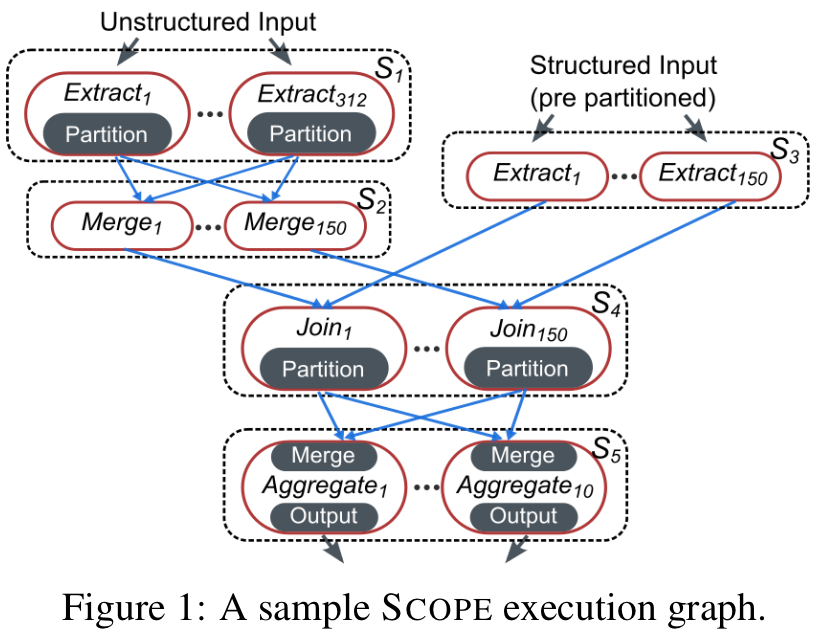
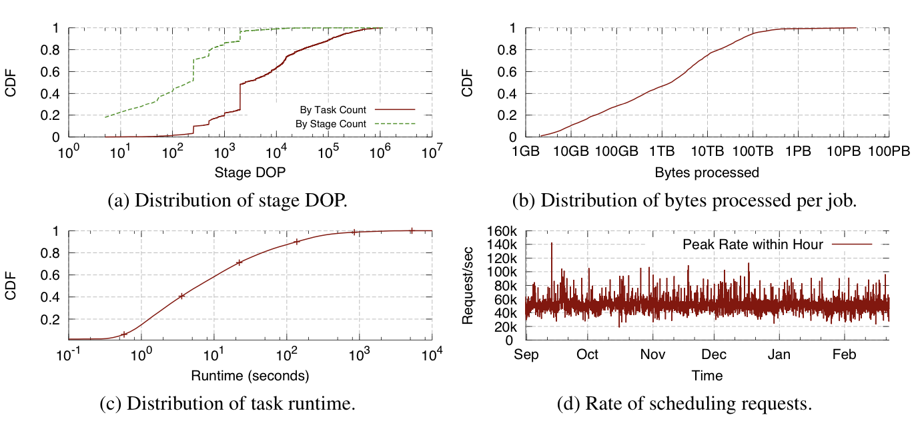
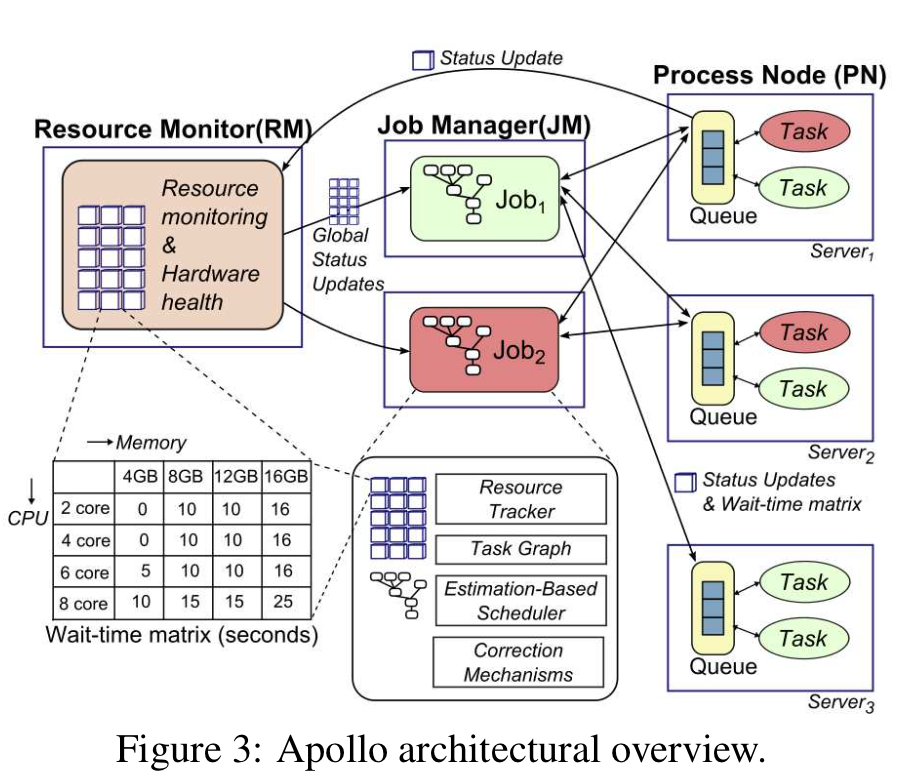
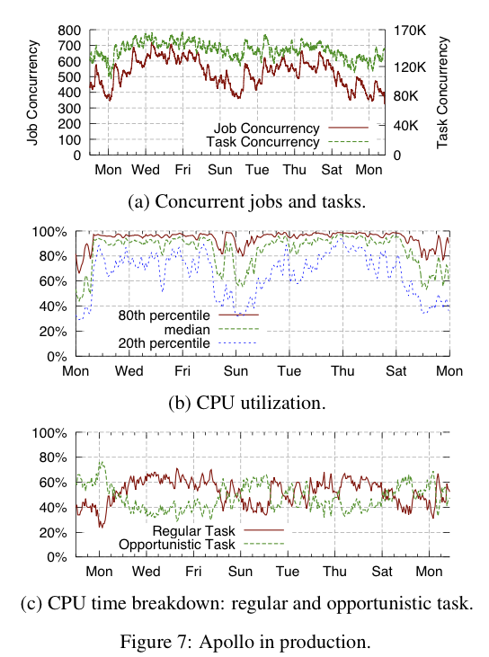
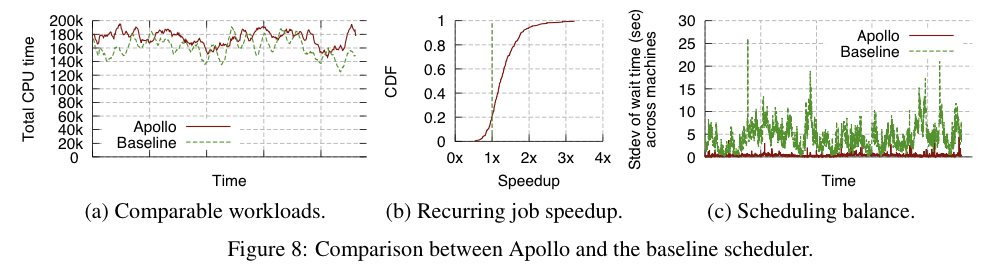
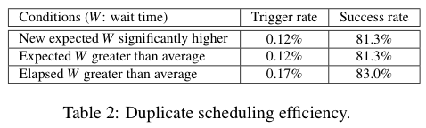
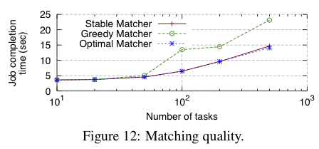

# Apollo: Scalable and Coordinated Scheduling for Cloud-Scale Computing

## Motivation

> The production clusters that we **(M$)** use for data-parallel computations are growing in size, each with over 20,000 servers. A growing commu- nity of thousands of users from many different organizations submit jobs to the clusters every day, resulting in a peak rate of tens of thousands of scheduling requests per second.  

微软的并行式计算集群拥有超过两万台服务器, 每天有很多用户向集群提交各种各样的计算任务. 调度器的峰值压力达到了每秒万次,  并且计算任务的种类也是多种多样的. 

需要一种**调度框架**, 在面对大量复杂的计算任务时能够合理地利用系统资源, 优化性能并且应对意外情况. 要求框架达到: 

1. 在能在数量上万的服务器集群上进行**扩展**, 处理调度决策的**吞吐量**达到每秒万次.;
2. 用户计算请求调度的**公平性**;
3. 能结合**计算任务的locality**, **计算任务的特征**和**集群现有负载**等因素做出调度决策--**充分利用集群计算资源**来尽可能**缩小用户任务的处理延迟**.

## Workload

- 分布式文件系统 (GFS和HDFS)中, SQL-Like语言的计算作业

- 计算作业通过Optimizer转化为物理执行计, 表示为有向无环图(DAG)

  - vertice: 任务, 即基本计算单元
  - edge: 任务之间的数据流
  - DOP: 相同输入上, 不同分区里相同的计算任务将在逻辑上分组, 每个组的任务数量即为并行度

  

  > S1&S3: 数据(用户日志)收集任务, 来自磁盘或内存
  >
  > S2: 数据分区并汇总 
  >
  > S4: 执行分区Join
  >
  > S5: 分区汇总后输出

### 公平, 可预测的任务调度

**利用Token分配工作容量**

- Token: 集群内执行常规任务的授权, 只消耗CPU和内存, 调度过程遵循令牌分配
- 计算作业通过其Token数反应其任务量, 同时**表征其消耗的CPU和内存资源**
- Virtual Cluster: 根据Token数创建的集群内的虚拟化自治区
  - 安全性
  - 内部资源共享
  - 维护作业队列, 控制作业准入
  - 处理令牌在作业之间的分配
  - 完成工作优先级, 暂停和取消等功能

### 作业调度过程

1. 准备队列, 存放待调度的任务
2. 重整队列, 根据任务优先级
3. 计算管理, 将计算资源分配给作业, 同时决定作业处理的时序
4. 任务调度, 将任务分发到指定的server
5. 故障恢复, 监控调度后的任务, 任务失败时恢复或标记失败
6. 任务完成, 在DAG中检查任务和依赖任务, 转移到就绪队列
7. 作业完成, 重复4-6直到作业中所有任务就绪

### Workload 特征

Workload的特征对Apollo的设计产生了深远的影响 (after all, 这是来自工业界的产品)

1. 作业数量大: 日均作业超过100, 000, 任意时刻都有数百作业运行

2. 作业差异大: 

   - 大型作业: 
     - 处理PB级别的数据
     - 数十次join,
     - 聚合操作
     - 用户定义的功能
     - 需要花费数个小时; 

     (CPU或Memory consuming, 或者兼而有之. 但都是强IO consuming的,)

   - 小作业:
     - 只处理GB以下数据
     - 几秒内完成

3. SQL-Like语言的执行作业(例如SCOPE), 需要为作业分配不同的资源

4. Workload本身也会随着业务推进的时间发生变化 (宏观上长周期的变化)

#### e.g. SCOPE执行作业的复杂性

根据数据量和复杂性选择DOP, 在单个作业中也会动态变化

a). DOP在生产环境中的分布: 利用统计信息推断处于同一DOP数量级的任务行为, 帮助调度

b). 作业数据量的分布

c). 任务处理时间的分布: 需要缓存外部文件

d). 调度请求率 (调度处理吞吐量)

## Framework

> Apollo adopts a **distributed and coordinated architecture**, where **the scheduling of each job is performed independently** and incorporates **aggregated global cluster load information.**

- 分布式协调框架,
- 作业独立调度(Virtual Cluster)
- 共享全局负载信息

- Job Manager(JM): 调度程序本体, 管理每个作业的声明周期. 
  - 调度算法使用了RM和PN上的全局负载信息
- Resource Monitor(RM): 资源监视器. 在集群层面整合来自PN的负载信息
  - 向JM汇报集群全局状态视图
  - 逻辑上的完整实体, 物理实现可以分散
  - 大规模监视: 对[分布式资源集合]状态的动态修改
  - 树形结构, gossip协议
  - 实现基础: 主从配置Paxos
  - Another topic...
- Process Node(PN): 进程节点. 位于每个server上, 管理本地资源, 进行本地调度
  - 当调度运行到PN时, JM直接同PN更新状态
  - 维护本地任务队列 (推断wait-time MATRIX 决定其未来资源)

### 主要特征

#### 分布式 + 松散协调

集中调度处理限制了其扩展性. 分布式框架的调度质量难以平衡: 每个调度阶段保持全局负载信息独立调度

#### 估计模型

估计模型对每一个提交任务完成时间进行预估. 模型设计中同时结合局部性原理, 服务器负载和其他各种因素，对各个因素进行加权决策, 估计模型还可以利用统计历史信息进行自我优化

#### 轻量硬件引入

引入了轻量级的硬件独立机制来为调度器提供集群中所有服务器上的资源使用情况, 拱调度器使用

#### 校正机制

处理和调整集群中可能会出现作业运行时间估计不准确、作业冲突、运行时一些不正常的行为等意外状况

#### 机会调度

常规任务regular tasks 机会任务opportunistic tasks 

保证常规作业的低延迟的同时使用机会作业来提高集群的利用率, 并引入了基于token的机制来管理容量并通过限制常规任务的总数来避免集群的负载过高.

#### 增量部署过程

Apollo的设计是为了替代生产环境中的旧调度器, 因此在设计时支持分阶段部署到生产环境中并进行验证

## Performance

- 在大规模集群中扩展和利用资源的程度如何？ 

  

  > Combined, those results show that Apollo is highly scalable, capable of scheduling over 20,000 re- quests per second, and driving high and balanced system utilization while incurring minimum syqueuing time.
  >
  > 高扩展性, 调度吞吐量超过20, 000每秒, 请求列队时间最短, 提高系统的平衡利用率

- 调度质量如何？ 

  

  > Apollo delivers excellent job performance compared with the baseline scheduler and its scheduling quality is close to the optimal case.
  >
  > 调度质量接近上界

- 使用的任务执行和排队时间的估算值有多准确？估算值有多大帮助？ 

  

  > Apollo provides good estimates on task wait time and CPU time, despite all the challenges, and esti- mation does help improve scheduling quality. Further improvements can be achieved by leveraging statistics of recurring jobs and better understanding task internals, which is part of our future work.
  >
  > 对等待时间和CPU时间的预测良好, 且有助于提高调度质量. 统计信息可以进一步利用.

- 如何应对动态集群环境？ 

  

  > Apollo’s correction mechanisms are shown effective with small overhead. 
  >
  > 动态校正且开销跟很小

- 核心调度算法的复杂度是什么？ 

  

  > Apollo’s matching algorithm has the same asymptotic complexity as a naive greedy algorithm with negligible overhead. It performs significantly better than the greedy algorithm and is within 5% of the optimal scheduling in our simulation. 
  >
  > 复杂度渐进于朴素贪心, 然而性能更优

## Thoughts

Apollo诞生于工业界, 有许多的设计确实非常违反理论直觉. 比如大的架构设计: 分布式的调度框架同时保持各个调度节点持有全局的负载信息. 随着集群规模扩大, 和拓扑结构复杂度上升, 全局负载信息的收集, 广播不小的数据量和数据一致性都是理论上很尖锐的问题. PN和JM的直接沟通又好像破坏了系统设计的层次性原理. 最终, 利用了成熟的gossip协议和对数据一致性无伤大雅的忽略, 相对漂亮地完成了调度这一核心目标.

然而核心的调度算法和估计模型却有着很强的理论性, 对作业的DAG抽象, DOP的衡量, wait-time MATRIX的设计, Locality的运用和机会调度的引入由确实遵循了设计原理, 结局也是令人满意的.

吸收实际生产中的best-practise和成熟工业产品, 同时在理论指导下设计算法和架构, Apollo做到了productive.

