# Omega

## introduction
传统的集中式集群调度器扩展性和响应速度都比较差，降低效率，资源利用率以及影响集群的扩展

新的实现方式利用共享状态(shared state)以及(lock-free optimistic concurrency control)

工作条件是在真实的Google的工作负载下进行的

对于一个集群来说，造价通常是昂贵的，所以要最大限度的利用，可以提高效率和资源利用率的方法是，把一系列的CPU密集型与Memory密集型任务放在一台机器上，把各种大型小型的任务，batch和低延迟的任务放在一起，但是这样做就给了调度系统很大的麻烦，一般的任务分配是与集群大小相关的，越大的集群需要的调度算法也就越复杂，这样，系统的可扩展性就会收到很大的限制，因为每次扩展系统就要重新写调度算法

two-level的集群调度可以满足一部分扩展性的要求，但是这个加锁与局部算法导致对于一些需要有全局状态才能更好分配的任务来说，这个架构做的并不好

Omega使用的是一种shared-state的技术，把全部资源的情况都放在不同的调度器中，并且对修改状态的操作加乐观锁，就是每个调度器都可以修改，并且以事务的方式提交，遇到冲突的情况则重新做调度

## workload

- cluster A: medium-size, fairly busy
- cluster B: larger size, in use at Google
- cluster C: a published example

job分为batch与service

三个集群的workload都是，job数batch占绝大多数，但是大部分资源花费在service上

service的运行时间长，并且task的数量也少于batch

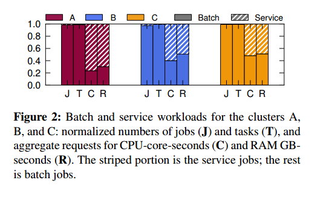
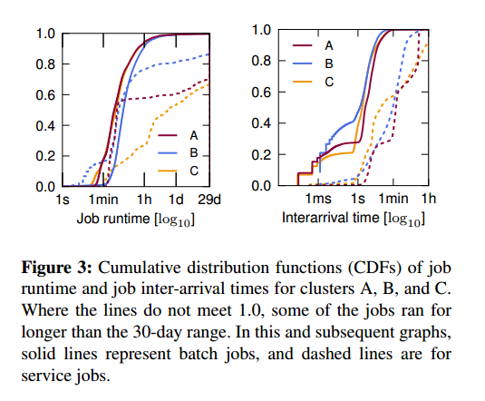

## taxonomy(分类)

详细介绍了figure 1中的三种scheduler的工作特点

## design comparison

### simulators

two simulators
- lightweight simulator
- high-fidelity simulator

简化的模拟器
- 模拟的数据
- 两种类型的任务：batch&service
- 每个job最多尝试分配1000次

### metrics

#### T decision

tdecision = tjob + ttask × tasks per job

#### job arrival rate

#### job wait time 

从job到达集群到开始运行的时间

在多个job到达调度器时，调取器把这些任务放入一个queue中，当job数变多时，job会进入queue，并且调度器执行调度算法的时间也会变长

#### scheduler busyness

It increases with the per-job decision time, and, in the shared-state approach, if scheduling work must be redone because of conflicts

#### conflict fraction

Denotes the average number of conflicts per successful transaction. 

A value of 0 means no conflicts took place; a value of 3 indicates that the average job experiences three conflicts, and thus requires four scheduling attempts

#### error bars

indicate how much variation exists across days in the experiment: they show the median absolute deviation (MAD) from the median value of the per-day averages

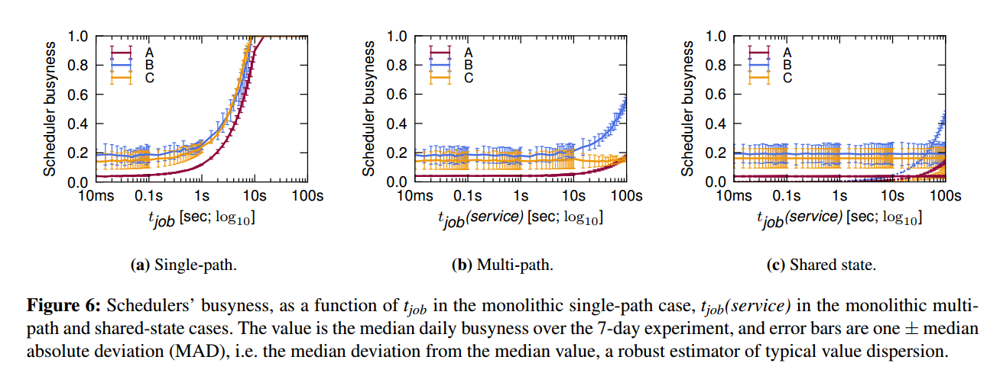

### monothlithic schedulers

- single-path

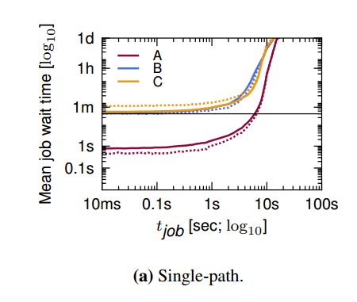
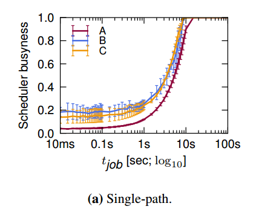

对于single-path的中心式调度器来说在job的执行时间一定范围内，调度器的busyness和等待时间都是成线性上升的，但是到了调度器工作负载饱和以后，等待时间大幅上升

对于batch job和service job来说，两者调度花费的时间差不多相同

- multi-path

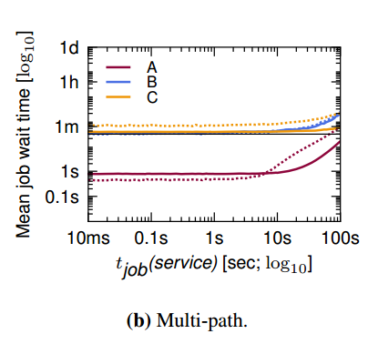
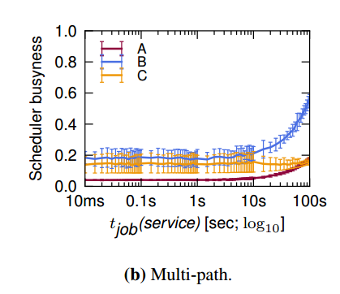

针对batch job做出优化的multi-path版本，可以看出batch的调度时间有了很大的加快，但还是会出现一些batch被long service阻塞住的情况

### Two-level scheduling: Mesos

一个资源管理节点和两套调度框架，一套专门调度batch job，另一套专门调度service job

由于mesos独特的保障公平性的算法，在处理batch job时，由于service讲一些资源锁住，所以导致一些batch job在尝试1000次之后还是没有费配到合适的资源，mesos对一些小规模job，对所有资源都利用的job效果比较好
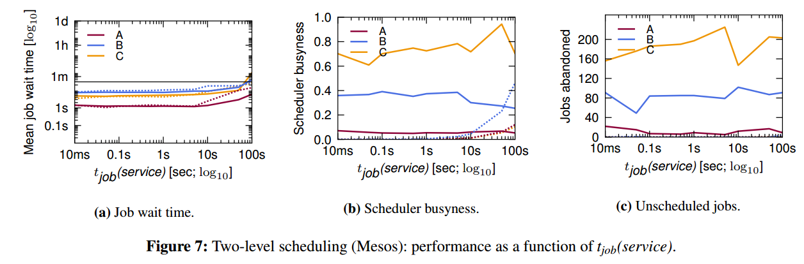

### Shared-state scheduling: Omega

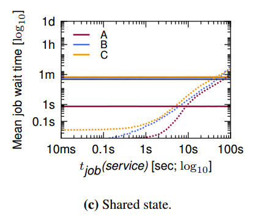
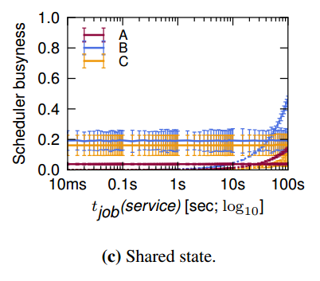

可以看出与中心式的调度相比，Omega的效果还是非常好的，对于两种类型的job，调度器都可以分别进行调度而不会出现卡死的情况；

在验证Omega系统的可扩展性的时候，可以通过增加job arrival rate来观察系统的可扩展性

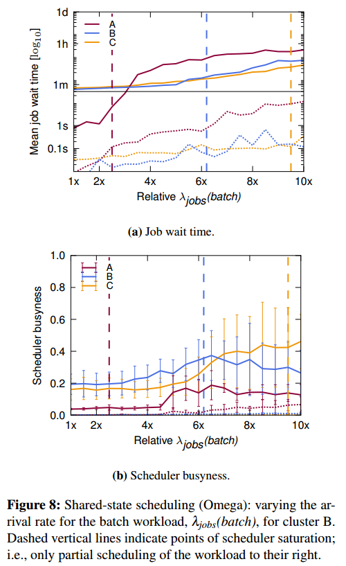
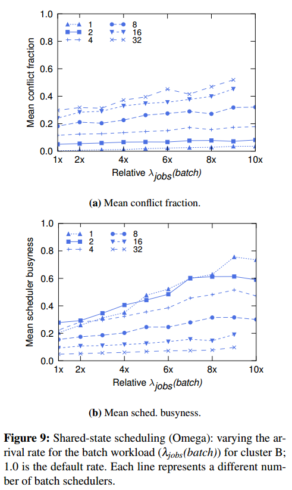

从figure 8中可以看出，两种job的影响；

batch job主要是高强度的任务，而service job主要是冲突变多

扩展性的瓶颈还在batch job，在单独对batch job的测试中，从figure 9可以看出在提高batch job的数量时确实冲突变多，但是系统也能够扩充至少32倍

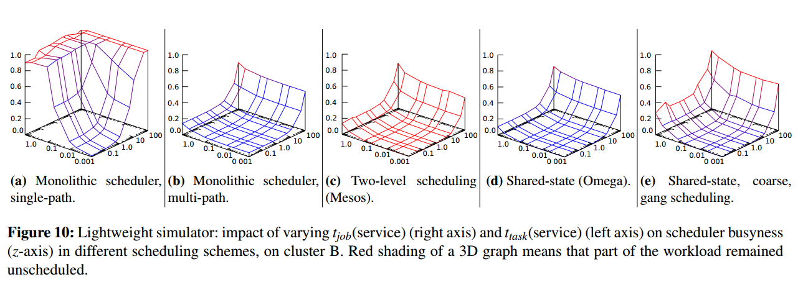

Omega的特点

- 扩展性强
- 支持独立的调度器实现
- 可以暴露整个集群资源的情况

## Trace-driven simulation
当Omega使用高仿真的数据做测试时，表现出了跟简化版模拟器相同的结果

但是由于选择资源的冲突变多了，对比估测的没有冲突的版本，调度器要增加40%的负担

当tjob比较短时，可以有很好的效果

而且share-state scheduler 还支持负载均衡，在一定程度上可以减少调度的时间，但是实验也仅限于三个调度器，还不能支持很多

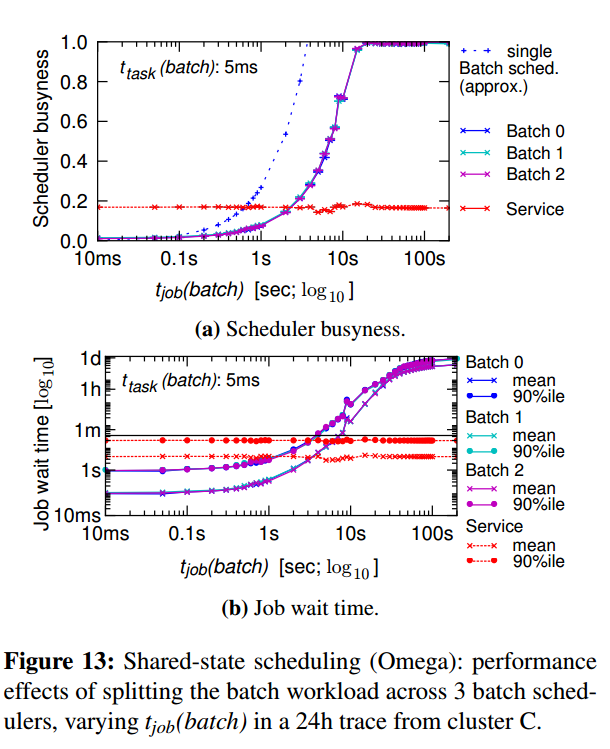

在处理冲突方面使用两种技术：coarse-grained conflict detection和all-or-nothing scheduling

coarse-grained conflict detection就是在整块状态刷新时拒绝事务写入

最终选择的是以job为颗粒度的检测冲突，而且使用的增量式的事务来记录

### thinkings
- 一开始我看到这个想法的时候，我的第一反应是如果两个调度器用同一个状态，并且使用乐观锁的话，选择资源的冲突率应该会很高，但是这篇文章直到最后使用真实数据来模拟的时候才发生了很高的冲突率

- 有一点没有想明白的是在冲突处理的部分，文章说使用all-or-nothing的模式，可以处理gang schedule的问题，文章中对这个共同调度也没有说明什么

- 文章在扩展部分说Omega调度的公平性还没有叙述，感觉这部分跟资源的分配有关，但是这片文章并没有说资源的分配方式，可能在其他地方有说明

- 使用乐观锁的方式，我觉得在短时的job中效果比较好，也就是资源释放的比较频繁，而在一些长时占用资源的job中，乐观锁的重试次数应该会变多