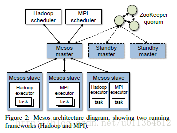
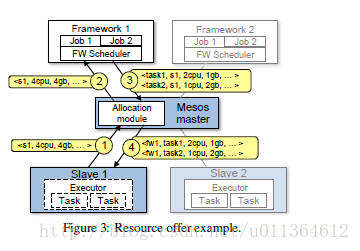
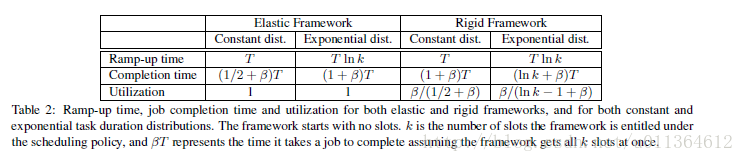

# Mesos（分布式计算框架）
- Mesos是Apache下的开源分布式资源管理框架，它被称为是分布式系统的内核。Mesos最初是由加州大学伯克利分校的AMPLab开发的，后在Twitter得到广泛使用。
## Mesos 特点
- 实现在不同的集群架构上共享商品计算机集群
- 提高集群的利用率,防止数据的重复
- 有一个细粒度的manager进行共享资源
- 实现数据的本地化
- Mesos实现了资源的分配，具体来决定每个集群架构的资源分配，以及集群架构接受的资源，对故障也有一定的处理。
- 不同为特定的问题域创建和运行新的集群架构。
## 设计初衷
- 存在有许多不同的计算机集群风格，我们希望实现一个集群他能运行多种集群架构。而对于每个程序都选择最好的一种。但是就会出现由于要在不同集群之间共享数据而出现，计算集群中的数据重复的巨大代价。
- 一些现存方法的问题，静态划分集群，然后在每个分区中运行一种集群架构，这样是无法提高使用率和有效进行数据共享的。原因是未充分考虑方案的粒度。而一些细粒度的集群框架则是因为独立开发无法实现共享。
## Mesos实现方法综述
- 大体的解决方案是建立一个资源共享层，提供共有的访问集群资源的接口，从而未集群计算架构实现细粒度共享。
- Mesos致力于实现一个有效的调度系统。Mesos必须是可容错的和高可用的，实现不同集群平台的调度需求。
- Mesos有一个中央调度器，我们输入框架要求，资源可用调度和组织策略等等，然后系统就会帮我妈实现一个全局的调度。但是这样的问题就是一个方面由于为了兼容性，这个系统会很复杂。另一个方面就是性能问题因为我们需要解决一个百万级的任务的优化的问题。最后就是可扩展性的问题，因为我们无法要求之后开发的框架都按照相同的调度策略。
- Mesos通过实现一个resource offer这个抽象，这个抽象下面有一组资源，一个集群框架可以对其分配资源来运行任务。而集群框架则决定接受哪些资源以及哪些任务使用这些资源运行。
## 体系架构
### 设计哲学
- Mesos为使多样化的集群架构能够有效共享计算集群而提供一个可扩展的和有弹力的core。所以我们的设计哲学是实现一个最小的接口让他能够跨集群架构进行资源的共享。而任务的调度和执行则交给下面的集群去做。
### 原理综述

- 图解：
> 1. Mesos master:管理每个集群上运行的slave进程，通过一定的组织调度策略进行资源的分配。
>2. resource offers：实现跨集群框架的细粒度共享。每个resource offer是一个在多台slave节点上的空闲资源的列表。
>3. Mesos slave：集群运行在不同的 Mesos slave
>4. 每一种运行在Mesos的集群框架包含两部分：一个注册到master进程中的调度器（scheduler），用于提供资源；以及一个运行在slave节点上的执行（executor）进程，用于运行集群框架的任务。master进程决定给每个进程提供多少资源，集群框架的调度器选择使用哪一种被调度的资源。
- 集群框架调度的原理
- 
> 1. slav1向master进程报告有4个CPU和4GB的内存空间
> 2. master调用分配模块，并将相关信息提供给scheduler
> 3. master进程向集群框架将resource offers的信息发送。
> 4. 集群框架返回运行任务所要用的资源。
> 5. master 向slave转发颂这些任务所要用的资源的信息。
> 6. 其他问题：由于目前来说，是通过一个拒绝机制来满足所有的集群框架的约束。这样做的坏处是效率的问题，为了拿到一个满足的资源约束的resource offers可能要等待很长的实现。所以，Mesos通过设置一个filters过滤器，来为一个集群框架设置白名单，这样的话集群框架本身就具有很大的决定权。但是，我们又发现在实践中这样做的效率更加低。
### 资源的分配
- Mesos将资源分配的决定权委派给分配模块，他大致有两种策略一种是公平策略，另一种是有严格的优先级。
- 在短期的任务中，Mesos是可以在任务结束时，重新分配资源的，但是如果是长期地任务，分配模块也能自己杀死任务，在彻底结束任务的之前会有一个宽限期来清理。
- 分配模块也有清理任务的功能。有两个方面应该考虑，其一如果是任务之间没什么依赖的就可以直接杀死。如果有依赖的话，我们必须有一个“被保证的分配”防止集群框架自身杀死自身。就是这一块资源是无法随意被其他任务调用的。
### 隔离
- Mesos利用现有的操作系统隔离机制，为运行在同一个slave节点上的集群框架executor之间提供了性能上的隔离。
- 我们目前使用操作系统的容器技术实现资源的隔离，尤其是Linux Container和Solaris Projects。这些技术能够限制一个进程树对CPU、内存、网络带宽和IO的使用（在新的linux内核中）。使用容器是Mesos的一大优势
- Mesos对错误处理的三种机制。第一，一些集群如果总是拒绝特定的资源的话，Mesos就允许他们缩短拒绝的进程，并通过filter来阻止交流。第二，Mesos由于需要响应一个resource offer，来计算集群框架的资源量。如果一个集群框架已经很久没有对一个rsource offer进行响应，Mesos将会撤回resource offer，并重新将资源提供给其他的框架。
### 容错
- Mesos master进程的容错机制是相当的重要的，master有一个状态是soft state，他使得master节点可以从slave节点中和集群框架调度器上的信息完整的重建内部的状态。而master仅有的活动的状态是slave节点的列表状态和活动的集群框架的列表和正在运行的任务列表。当master出错的时候，slave节点和调度器会关联下一个被选择的master节点，并恢复他们。
- 为了防止调度器的出错，Mesos允许注册多个调度器。这样一个调度器的失效并不会造成整个系统的奔溃。为了实现这个机制，必须设计调度器的共享策略。
## Mesos 性能
- Mesos倾向于所有的节点的对等，而对于不同集群的不同节点会有一个调度中心执行公平的共享，能够处理不同时长的运行的时间的任务，不会影响短期任务的集群的性能
- 对于Mesos性能的考量主要有三个度量：集群框架的等待时间，作业的完成时间和系统的使用率
- 有弹性的架构的特点是在节点上获得的资源能够马上投入使用，并且可以马上释放。死板的集群架构的框架，只能获得固定数量的资源才开始执行他们的工作，而且无法动态的增加新的资源或者减少占用资源。
- 强制性和建议性的。如果为了让系统运行起来必须得到的资源就是强制性的资源。如果系统具有了这一块的资源之后运行的更加的好就是建议性的资源。
- 
- 集群的等待时间：常量时间为T，指数时间为T*lnk
- 作业完成的时间：弹性完成时间最多为（1+&）*T，而死板的完成时间为（lnK+&）T，这是因为会花费平均Tlnk长度的时间来得到它全部的槽，并且开始执行作业。
- 系统利用率：弹性作业能够充分的利用系统资源。因为他可以较为自由的动态加载和释放资源。而死板的系统因为他要等到资源的数量达到一定的上限是才开始工作，这段时间的资源是无法被充分利用的。
- Mesos存在一个拥有全部集群偏好信息的槽。他就会在一种集群设置中有一个偏好的槽，一旦有任务运行就可以得到这个槽的全部的份额，如果我们不考虑偏好的话就应该考虑对于这些经常被读取的槽该如何惊醒分配。
- 如果一个任务集合中长任务的平均期限远远长于短任务的期限，那么将这两种任务同构的话就会损害段任务，使得他的等待时间很长。
- Mesos的挑战是调度器不知道每种集群框架的偏好。幸运的是，被证明有一种简单的方式里实现上文描述的偏好的槽的权重分配：简易执行彩票调度，给每个集群架构提供给他们想要的分配成正比的槽。
- 对于Mesos我们认为应该进行以下的以下资源分配的原则
> 1. 采用短期任务：这个集群框架将能够分配任何短期槽中保留的资源，使用短期任务能在集群框架丢失任务之后，最小化减少不必要的工作
> 2. 弹性的进行扩展：一个集群框架在得到资源后迅速使用资源而不是等待它得到的资源到达一个最小的额度才使用资源的能力将会允许集群框架更早地开始（或完成）它的作业。
> 3. 不要接搜未知的资源。建议集群框架不要接受它们不能使用的资源，因为大多数分配策略会在提供资源时计算一个集群框架已经拥有的全部资源。
- 对于Mesos限制性能进一步优化的因素：
> 1. 碎片化：当任务有异构的资源需求时，一个分布式的集群框架集合可能和中心调度器一样不能优化装箱问题。然而注意到由于局部优化装箱而导致浪费的空间被限制在最大的任务的数量和节点的数量的比率之下
> 2. 相互依赖的集群框架约束：我们可以创建一种场景，由于集群框架之间很深的依赖关系（比如，来自两个集群框架之间的任务不能共存），其中只有全局的单一的集群分配能够表现得很好。我们证明这样的场景在实践中是罕见的。
> 3. 集群复杂性：使用resource offer可能使得集群调度更加复杂
