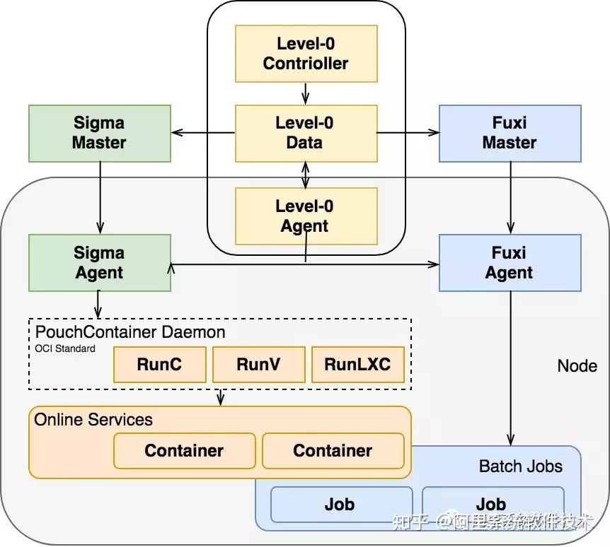
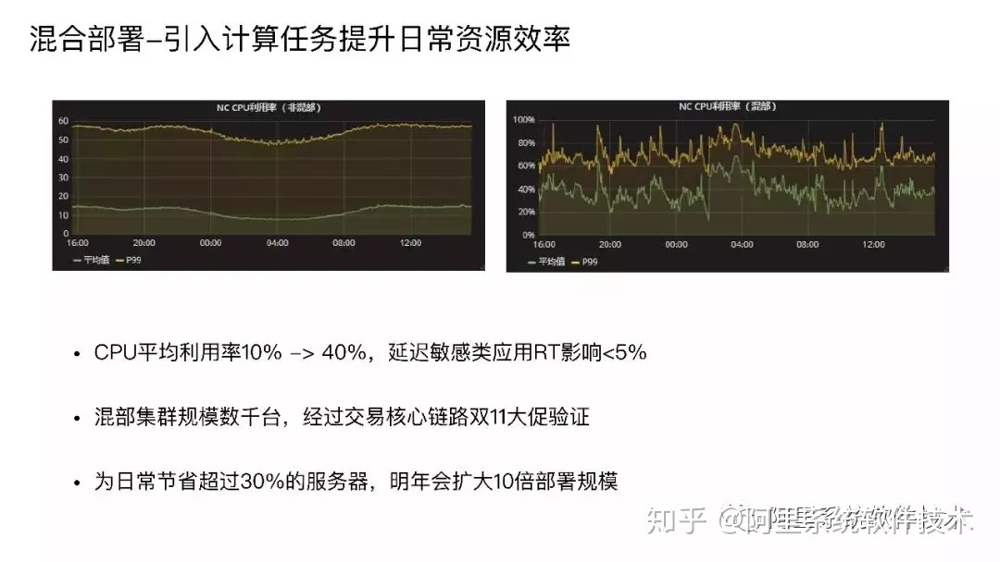
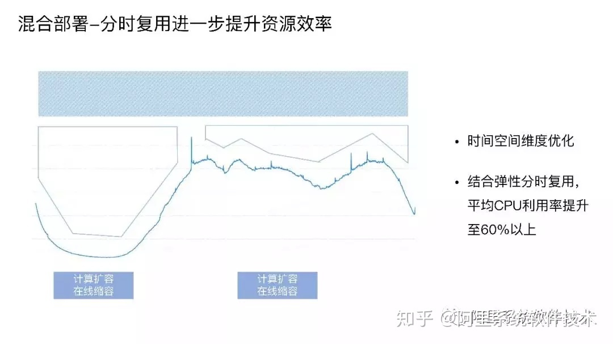

# SIGMA

用有限的资源成本最大化提升用户体验和集群吞吐能力。应用业务系统资源申请量和使用量之间差距巨大，不同的机器的资源使用率差距较大，碎片的存在也导致了分配率不高，应用之间的干扰程度不一，给应用的 SLO 保证带来了挑战。统一调度系统 sigma 通过策略和算法在成本，性能，效率找到平衡。

### 统一调度体系

Sigma 有 Alikenel、SigmaSlave、SigmaMaster 三层大脑联动协作，Alikenel 部署在每一台物理机上，对内核进行增强，在资源分配、时间片分配上进行灵活的按优先级和策略调整，对任务的时延，任务时间片的抢占、不合理抢占的驱逐都能通过上层的规则配置自行决策。SigmaSlave 可以在本机进行容器 CPU 分配、应急场景处理等。通过本机 Slave 对时延敏感任务的干扰快速做出决策和响应，避免因全局决策处理时间长带来的业务损失。SigmaMaster 是一个最强的中心大脑，可以统揽全局，为大量物理机的容器部署进行资源调度分配和算法优化决策。
整个架构是面向终态的设计理念，收到请求后把数据存储到持久化存储层，调度器识别调度需求分配资源位置，Slave识别状态变化推进本地分配部署。

### 混部架构

在线服务属于长生命周期、规则策略复杂性高、时延敏感类任务。而计算任务生命周期短、调度要求大并发高吞吐、任务有不同的优先级、对时延不敏感。基于这两种调度的本质诉求的不同，我们在混合部署的架构上把两种调度并行处理，即一台物理机上可以既有 Sigma 调度又有 Fuxi 调度，实现基础环境统一。Sigma 调度是通过 SigmaAgent 启动 PouchContainer 容器。Fuxi 也在这台物理机上抢占资源，启动自己的计算任务。所有在线任务都在 PouchContainer 容器上，它负责把服务器资源进行分配并运行在线任务，离线任务填入其空白区，保证物理机资源利用达到饱和，这样就完成了两种任务的混合部署。

### 混部关键技术

#### 内核资源隔离上的关键技术

在 CPU HT 资源隔离上，做了 Noise Clean 内核特性，解决在 / 离线超线程资源争抢问题。
在 CPU 调度隔离上，CFS 基础上增加 Task Preempt 特性，提高在线任务调度优先级。
在 CPU 缓存隔离上，通过 CAT，实现在、离线三级缓存 (LLC) 通道隔离 (Broadwell 及以上)。
在内存隔离上，拥有 CGroup 隔离 /OOM 优先级；Bandwidth Control 减少离线配额实现带宽隔离。
在内存弹性上，在内存不增加的情况下，提高混部效果，在线闲置时离线突破 memcg limit；需要内存时，离线及时释放。
在网络 QoS 隔离上，管控打标为金牌、在线打标为银牌、离线打标为铜牌，分级保障带宽。

#### 在线集群管理上的关键技术

对应用的内存、CPU、网络、磁盘和网络 I/O 容量进行画像，知道它的特征、资源规格需求，不同的时间对资源真实使用情况，然后对整体规格和时间进行相关性分析，进行整体调度优化。
亲和互斥和任务优先级的分配，哪种应用放在一起使整体计算能力比较少、吞吐能力比较高，这是存在一定亲和性。
不同的场景有不同的策略，双 11 的策略是稳定优先，稳定性优先代表采用平铺策略，把所有的资源用尽，让资源层全部达到最低水位。日常场景需要利用率优先，“利用率优先” 指让已经用掉的资源达到最高水位，空出大量完整资源做规模化的计算。
应用做到自动收缩、垂直伸缩、分时复用。
整个站点的快速扩容缩容，弹性内存技术等

### sigma特点

* 灵活可配置的调度策略
* 复杂约束下的批量调度优化
* 精确高水位排布
* 大规模快速建站

#### 灵活可配置的调度策略

* 支持多样化的应用场景

* 调度优选模型的建立

*业务团队开发出新的策略可立即生效，不需要要代码发布

### 展望

* 资源最优
   
   * 混合云架构进一步发展，混合云深度联动，实时共享资源
   * 通过大规模混部、优先级差异化提升资源使用效率

* 智能化调度 更好的感知应用的SLA需求，减少应用间干扰

* 适应异构计算需求，为异构计算优化

