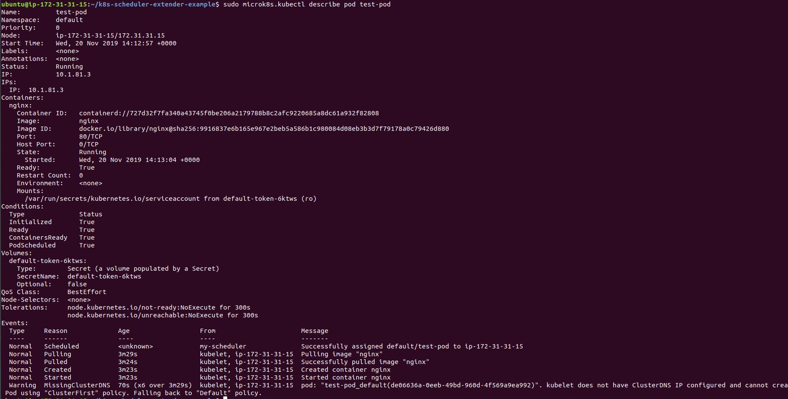

# kubernetes集群搭建与scheduler策略配置记录

## 搭建k8s集群
先去aws上申请几个节点，2核4G就ok

安全组策略上，可以先在入站的规则里加上所有ip所有端口，等到集群建立好之后可以把ip缩小到172开头和10开头的子网，也可以只加上别的机器的公网ip，这样更安全

```sh
sudo snap install microk8s --classic --channel=1.16/stable
```

先装上microk8s，然后等着初始化，好了以后，执行一个version看看，也可以把microk8s加入sudo用户组避免重复输入sudo

可以用下面这条指令判断microk8s是否安装完成并启动

```sh
microk8s.status --wait-ready
```

在master节点（自己决定是哪台EC2机器）
```sh
microk8s.add-node
```

后面会提示你在node节点上去跑一条指令，在前面设置好安全组入站规则后这句指令应该很快就搞定

这时候在master上执行

```sh
microk8s.kubectl get no
```

就可以看到对应的node节点，当然在node节点上执行这条指令会告诉你这是一个node，你要去master上执行

这时候我们最简单的多节点kubernetes集群就搭好了

## 配置默认scheduler
#### references in this part
* https://microk8s.io/docs/configuring-services
* https://kubernetes.io/docs/reference/command-line-tools-reference/kube-scheduler/
* https://kubernetes.io/docs/concepts/scheduling/kube-scheduler/
* https://github.com/kubernetes/kubernetes/blob/c014cc274049ab1ab28b3acdd87da68eab5ffb30/examples/scheduler-policy-config.json


根据microk8s文档的描述，我们可以为默认的scheduler选择自己的filter与score算法

> The kube-scheduler daemon started using the arguments in `${SNAP_DATA}/args/kube-scheduler`. These are explained fully in the upstream [kube-scheduler documentation](https://kubernetes.io/docs/reference/command-line-tools-reference/kube-scheduler/).

kube-scheduler的参数就在`${SNAP_DATA}/args/kube-scheduler`里面

我们找到这个文件，打开一看，他告诉我们config放在了别的地方

```sh
--kubeconfig=${SNAP_DATA}/credentials/scheduler.config
```

不过根据官网上面的参数，这个kubeconfig主要是有关authorization的

> | --kubeconfig string |                                                              |
> | ------------------- | ------------------------------------------------------------ |
> |                     | DEPRECATED: path to kubeconfig file with authorization and master location information. |

我们真正要添加的参数是这几个（但好像都标记为弃用了。。。）

> | --policy-config-file string |                                                              |
> | --------------------------- | ------------------------------------------------------------ |
> |                             | DEPRECATED: file with scheduler policy configuration. This file is used if policy ConfigMap is not provided or --use-legacy-policy-config=true |
>
> | --use-legacy-policy-config |                                                              |
> | -------------------------- | ------------------------------------------------------------ |
> |                            | DEPRECATED: when set to true, scheduler will ignore policy ConfigMap and uses policy config file |

所以我们在这个`${SNAP_DATA}/args/kube-scheduler`文件中加上

```sh
--use-legacy-policy-config=true
--policy-config-file=${SNAP_DATA}/args/scheduler-policy-config.json
```

然后在同一文件夹下新建一个scheduler-policy-config.json文件

文件的内容可以参考那个example里面的，把内置的predicates和priorities加上去

然后重启scheduler这个服务

```sh
echo '-l=debug' | sudo tee -a /var/snap/microk8s/current/args/containerd
sudo systemctl restart snap.microk8s.daemon-scheduler.service
```

## 自己定义的scheduler

ps.其实是别人实现的

#### references in this part

* https://github.com/everpeace/k8s-scheduler-extender-example
* https://developer.ibm.com/articles/creating-a-custom-kube-scheduler/
* https://github.com/kubernetes/community/blob/master/contributors/design-proposals/scheduling/scheduler_extender.md

自己实现scheduler有三种方式

1. hack原来的代码，把自己的策略写进去
2. 自己写一个scheduler，需要对kubernetes有很深的理解
3. 用scheduler-extender来扩展

在github上找了一个别人的项目，使用的是第三种方式。就是用go语言写了一个服务器，提供两个接口来判断predicates和priorities，然后修改kubernetes的配置文件，把这个scheduler应用上去

然后新建一个pod试试

> ```
> Events:
>   Type     Reason             Age                  From                      Message
>   ----     ------             ----                 ----                      -------
>   Normal   Scheduled          <unknown>            my-scheduler              Successfully assigned default/test-pod to ip-172-31-31-15
>   Normal   Pulling            3m29s                kubelet, ip-172-31-31-15  Pulling image "nginx"
>   Normal   Pulled             3m24s                kubelet, ip-172-31-31-15  Successfully pulled image "nginx"
>   Normal   Created            3m23s                kubelet, ip-172-31-31-15  Created container nginx
>   Normal   Started            3m23s                kubelet, ip-172-31-31-15  Started container nginx
>   Warning  MissingClusterDNS  70s (x6 over 3m29s)  kubelet, ip-172-31-31-15  pod: "test-pod_default(de06636a-0eeb-49bd-960d-4f569a9ea992)". kubelet does not have ClusterDNS IP configured and cannot create Pod using "ClusterFirst" policy. Falling back to "Default" policy.
> ```

可以看到这个scheduled的状态是自己的scheduler做出的



## some other references

* https://developer.ibm.com/articles/creating-a-custom-kube-scheduler/
* https://thenewstack.io/implementing-advanced-scheduling-techniques-with-kubernetes/

