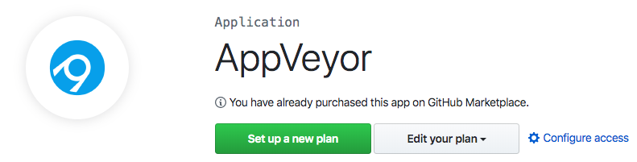
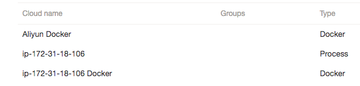
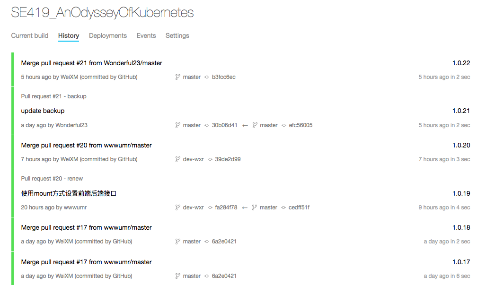
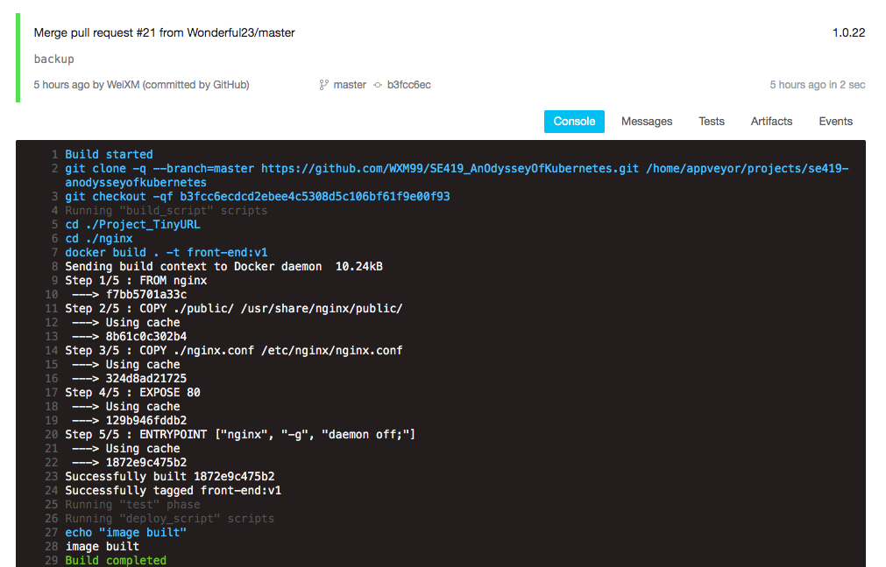

# Distributed TinyURL in K8S

## CI/CD

### Framework: AppVoyer

from Github marketplace: github.com/marketplace/appveyor

### Build: AppVoyer - Self-hosted jobs

Bring Your Own Cloud (BYOC) allows running builds on your own infrastructure. Builds could be run inside VMs (Azure, AWS, GCE, Hyper-V), in Docker containers (Windows, Linux and macOS) or directly on the host (Windows, Linux and macOS). [Read more about BYOC](https://www.appveyor.com/docs/byoc/).

In addition to the concurrent hosted jobs that are available in your plan we have added **5 free self-hosted jobs** to your account that can be run in your own cloud or computer.

### Commit Trigger 

https://ci.appveyor.com/project/WXM99/se419-anodysseyofkubernetes/history

### Deployment: K8 node

https://ci.appveyor.com/project/WXM99/se419-anodysseyofkubernetes/builds/29965843

