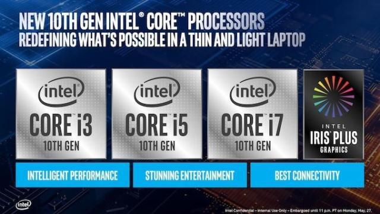
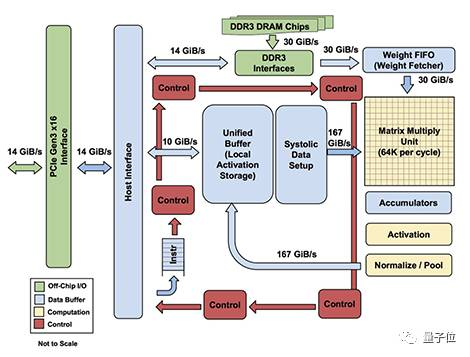
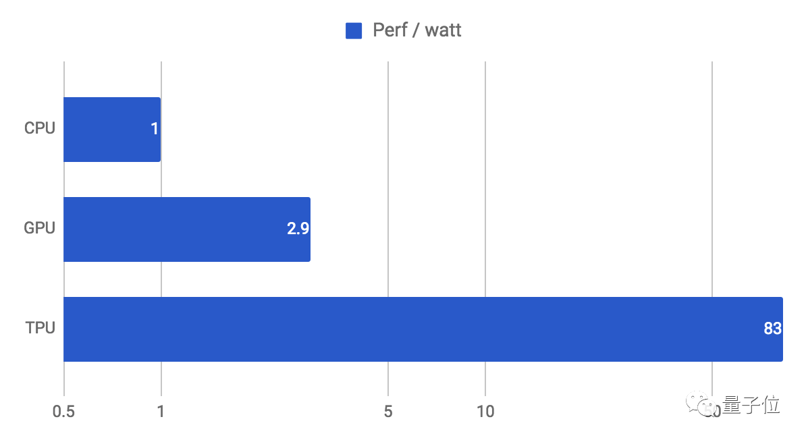

#  Technical Report On Computer Infrustructure

## CPU

CPU全称是"Central processing unit",主要承担的任务是以特定指令集执行计算机程序的算数，逻辑或者控制指令

CPU包括Control Unit，Arithmetic logic unit，Address generation unit，Memory management unit，Cache等部分

### 制造商

* Intel
* AMD

世界上top2的CPU制造商是Intel与AMD两家，在桌面CPU的市场被这两家公司独占，在cpubenchmark给出的统计中说到：“We do receive a small number of submissions of CPU types other than AMD and Intel however the percentage is so small as to make it not worth graphing”，其中Intel的市场份额约占7成，AMD约占3成

此外，还有其他的CPU制造商只出售CPU设计，比如ARM，MIPS

另外，现在智能手机上使用的芯片通常不被称作CPU，而是SoC（System on a chip），主要的公司有Apple，高通，华为海思等。这种芯片可以集成比如射频信号处理模块，模拟数字信号处理模块等；

### CPU指标

- 内核数

    内核数表示单个计算组件（裸芯片或芯片）中的独立中央处理器的数量

    一般情况下，内核数越多，性能越强

    现在Intel core系列处理器常见的有4,6,8内核，Xeon系列处理器有32个内核以上的内核数
- 线程数

    线程或执行线程是一个软件术语，指代那些可由单核 CPU 传递或处理的基本有序指令序列。

    CPU支持的线程数越多，说明它的性能越强。
    
    一般一个内核对应一个线程，不过超线程技术可以使核心数与线程数形成1:2的关系。

- 处理器基本频率

    处理器基本频率又称“时钟频率”或“主频”，是指处理器晶体管打开和关闭的速率。主频的单位是MHz或GHz，意思是CPU每秒跑几「百万次」（MHz）或「十亿次」（GHz）。作用主频是比较在同一系列内的芯片性能的唯一方法。CPU内部是一个个的运算单元，像小型计算器那样可以算一些加减乘除，而所谓的「跑一次」，就是CPU内部所有单元做一次动作，执行某些运算，2GHz的CPU就代表它可以每秒做20亿次的动作。
    
    因此主频越高，数字越大，执行的速度就越快，而这也是划分同代CPU产品定位的第一标准

    目前市场上常见的高性能处理器最大主频在4-5GHz之间，最高的主频来自AMD的一款CPU，达到了8.732GHz（As of 2014, the Guinness World Record for the highest CPU clock rate is an overclocked, 8.723 GHz AMD Piledriver-based FX-8370 chip.）

- 缓存

    根据ICS课上所学，为了支持memory hierarchy，CPU有告诉SRAM缓存，一般情况下，性能越好的处理器需要的cache也就越大

- 制程

    又常被称作光刻，指用于生产集成电路的半导体技术，采用纳米 (nm) 为计算单位，可表示半导体上设计的功能的大小。

    目前桌面级cpu制程在10nm，下一步的目标是7nm；在手机处理器上已经有小于10nm制程的芯片

- TDP-thermal design power

    热设计功耗（英语：Thermal Design Power，缩写 TDP，又译散热设计功率）的含义是当芯片达到最大负荷的时候〔单位为瓦（W）〕热量释放的指针，是计算机的冷却系统必须有能力驱散热量的最大限度，但不是芯片释放热量的功率。在其他参数相同的情况下，TDP越低表示该CPU发热更低，效率越高。

### 技术
- instruction pipeline
- multithreading
- parallelism
- virtualization
- Intel® Turbo Boost Technology 2.0

### others
- Intel的Tick-Tock

    Tick-Tock是Intel公司发展微处理器芯片设计制造业务的一种发展战略模式，“Tick-Tock”的名称源于时钟秒针行走时所发出的声响。Intel指，每一次“Tick”代表着一代微架构的处理器芯片制程的更新，意在处理器性能几近相同的情况下，缩小芯片面积、减小能耗和发热量；而每一次“Tock”代表着在上一次“Tick”的芯片制程的基础上，更新微处理器架构，提升性能。一般一次“Tick-Tock”的周期为两年，“Tick”占一年，“Tock”占一年。

    由于这种独特的产品升级方式，被网友戏称“挤牙膏”。

### references
* https://www.cpubenchmark.net/market_share.html
* https://en.wikipedia.org/wiki/List_of_computer_hardware_manufacturers
- https://en.m.wikipedia.org/wiki/Clock_rate
- https://en.wikipedia.org/wiki/System_on_a_chip
- https://www.intel.cn/content/www/cn/zh/architecture-and-technology/turbo-boost/turbo-boost-technology.html?_ga=1.147059508.281579711.1486467137

常见品牌：龙芯，酷睿，锐龙，骁龙

intel的i3,i5,i7代表性能的高低,后面的一开始的数字代表第几代,后三位代表在当代cpu的性能,性能越强数字越大。
如"core i5-8100"

如今酷睿系列已经出到第十代，使用Ice Lake架构，特点稳定功耗低，单核处理能力强。

锐龙系列则推出锐龙9，AMD 锐龙 9 3950X有16核32线程，超频达到4.7GHz

对比intel和amd，两个系列中前者单核处理能力强于后者，更适合游戏本，amd更支持超频，且线程数多，耗电多，价格较低，适合做adobe系列的媒体处理软件的cpu，视频剪辑与渲染等专业软件有专业算法提高多线程的利用效率，线程多的锐龙更占优势。

## Memory

### 内存简介

- 内存也叫作主存，是PC系统存放数据和指令的半导体存储器单元，也叫作主存储器。
- 通常有只读存储器（ROM-Read Only Memory）和随机存储器(RAM-Read Access Memory)和高速缓存存储器(Cache).
### 内存相关概念

#### 内存主频 
- 内存主频被用来表示内存的速度，它代表着该内存所能达到的最高工作频率。内存主频是以MHz（兆赫）为单位来计量的。内存主频越高在一定程度上代表着内存所能达到的速度越快。计算机系统的时钟速度是以频率来衡量的。晶体振荡器控制着时钟速度，在石英晶片上加上电压，其就以正弦波的形式震动起来，这一震动可以通过晶片的形变和大小记录下来。晶体的震动以正弦调和变化的电流的形式表现出来，这一变化的电流就是时钟信号。而内存本身并不具备晶体振荡器，因此内存工作时的时钟信号是由主板芯片组的北桥或直接由主板的时钟发生器提供的，内存无法决定自身的工作频率，其实际工作频率是由主板来决定的。
#### 内存容量
- 计算机的内存容量通常是指随机存储器（RAM)的容量，是内存条的关键性参数。内存的容量一般都是2的整次方倍。系统中内存的数量等于插在主板内存插槽上所有内存条容量的总和，内存容量的上限一般由主板芯片组和内存插槽决定。
#### 内存延迟
- 内存延迟是指等待对系统内存中存储数据的访问完成时引起的延期。根本问题在于处理器 （如英特尔&reg;至强TM处理器） 的主频接近4 GHz， 而内存芯片速率仅为400 MHz （如DDR 3200内存） —时钟速度之比为10:1。因此，当处理器需要处于内部高速缓存之外的数据项时，每个周期必须等待10个时钟周期才能使内存芯片完成数据的提取和发送。通常，这些提取需要检索多个内存周期，然后需要更长时间通过到处理器的路径。这就意味着提取数据会占用数百个处理器时钟周期，在此期间应用不能处理其它任何任务。
### 内存相关硬件
#### 随机存储器
- 随机存取存储器（Random Access Memory，缩写：RAM），也叫主存，是与CPU直接交换数据的内部存储器。它可以随时读写（刷新时除外），而且速度很快，通常作为操作系统或其他正在运行中的程序的临时数据存储介质。
##### RAM硬件结构及其工作原理

- 存储矩阵。相当于一个二维数组可以用来存储信息。
- 地址译码器。将寄存器地址的二进制数译成有效的行信号和列信号，以此来定位存储单元。
- 输入和输出。RAM可以通过输入输出数据线与CPU进行交换数据。
- 片选控制。就是由于RAM是很多集成在一起的，这时候就由这个硬件控制多个RAM中的一个或者是多个与CPU进行交互，而其他的RAM则被确认为断开状态。
##### RAM种类
- RAM分为SRAM和DRAM。
###### SRAM
- SRAM（静态随机存取存储器）是随机存取存储器的一种。只要保持通电，里面的数据就可以得到恒常的保存。但是电力消失的话，数据还是会消失的。它的存储原理是通过双稳态电路锁定电位高低，具有速度快，不用刷新等优点，但同时由于电路较为复杂，晶体管较多，集成度较低，运行功耗很大。
- SRAM原理图，如下
- 
###### SRAM原理解释
- 数据写入:
1. WL字线为低电位，置BL位线为1电位，NBL为0电位
2. 置WL为高电位，此时M5，M6导通
3. 存储单元的存储节点V2通过M6向NBL放电，达到0电位，M1截止
4. BL位线通过M5，VDD通过M3，对存储节点V1充电至1电位，M2导通
5. 置WL字线为低电位，M5,M6管关闭，此时存储单元的节点V1处于1电位状态，V2处于0电平的状态，这样就完成了向存储单元写入1的全过程。类似的方法可以写入0信号

- 数据读出
1. 预充BL和NBL位线到1电平，此时WL字线处于低电平状态。
2. 使WL字线为高电平，M5和M6导通
3. NBL通过M6和M2迅速放电至0电平，M1仍然截止。
4. VDD通过M3和M5对BL充电，使BL保持在1电平，M2仍然导通
5. 去掉字线上的WL的高电平，这样就完成了从存储单元读出1的全过程，而非破坏性读出。

- SRAM 数据保持
>当外界不访问单元时，字线WL处于低电平，这时使传播管M5，M6截止，位线BL，NBL和触发器之线的联系被中断，所以触发器状态不变。
>
###### DRAM
- DRAM利用电容存储电荷的原理保存信息，电路简单，集成度较高。但是由于电容存在着漏电的现象，所以为了避免信息丢失，在每隔一段时间都必须充电一次。刷新地址由刷新地址计数器产生，不是由地址总线提供。但是刷新是不能进行正常的读写操作。
- DRAM原理图如下。
- 
- Transistor，访问晶体管，它决定了是否允许对Capacitor进行信息的读写
- Capacitor，存储电容，通过电压的高低决定了逻辑上的1和0.
- Row line，决定了Transistor的导通或者截止。
- Column line外界访问 Capacitor的通道，可以对Capacitor
###### DRAM原理解析 
- 读数据
1. Row line设置为高电位，
2. 打开Transistor
3. Column line读取状态。
- 写数据
1. 写入的电位状态设定到Columnline
2. 打开Transistor
3. 通过Columnline改变Capacitor的状态。
##### RAM's Pros & Cons
- Advantage
1. 随机存储性.随时随地指定的向某个地址写入或者是读出
2. 访问速度很快.RAM几乎是所有访问设备中写入和读取速度最快的
- Disadvantage
1. 需要刷新（DRAM）.由于RAM是依赖电容保持电位的，一旦将电路放置过长的时间就要重新充电以保持电位的平衡
2. 对静电敏感性.由于其集成电路对静电荷非常敏感，静电会干扰电路，甚至会烧坏电路
#### ROM
- ROM（只读内存）Read-Only Memory,是一种只能读出事先所存储数据的固态半导体存储器，其特性是一种一旦写入ROM中就无法进行修改和删除，结构简单，读取方便一般用于不需要经常变更的电子产品中，存储的信息不回因为停电而消失。具体有ROM（写入不可改），PROM（只能写入一次），EPROM（利用高压将数据写入编程，抹除的时候需用紫外线）OTPROM(利用高压写入，但是无法进行抹除)，EEPROM（高压写入，利用高电场抹除）
#### Cache
- Cache ：即高速缓冲存储器，是位于CPU与主内存间的一种容量较小但速度很高的存储器。由于CPU的速度远高于主内存，CPU直接从内存中存取数据要等待一定时间周期，Cache中保存着CPU刚用过或循环使用的一部分数据，当CPU再次使用该部分数据时可从Cache中直接调用,这样就减少了CPU的等待时间,提高了系统的效率。Cache又分为一级Cache(L1 Cache)和二级Cache(L2 Cache)，L1 Cache集成在CPU内部。
### 内存现状与发展趋势
#### 现状
从最初的SDRAM 到DDR4，内存容量从64MB升级到了今天的16GB, 速率从133MHz升级到了今天的2133MHz, 单位功耗降低了80%以上
- 
- DDR-Double Data Rate SDRAM
- DDR2-第二代DDR
- DDR3-第三代DDR
- DDR4-第四代DDR
- LPDDR-Low Power DDR
- LPDDR2-第二代Low Power DDR
- LPDDR3-第三代Low Power DDR
- LPDDR4-第四代Low Power DDR
#### 发展趋势
- 2018年7月17日三星宣布成功开发出业内首款LPDDR5内存芯片, 基于10nm级 (10-20nm) 工艺。据悉, 该LPDDR5内存芯片单颗容量8GB (1GB) , 8GB容量的模组原型也做出据悉, 该LPDDR5内存芯片单颗容量8GB (1GB) , 8GB容量的模组原型也做出并完成功能验证。这颗业内首枚LPDDR5芯片具有极佳的性能, 其内存速度 (针脚带宽) 最高达3200MHz,是LPDDR4内存速度的1.5倍，同时功耗比LPDDR4降低了30%。
- 
- LPDDR5功耗大幅度下降，以及内存频数上升主要运用了以下技术。
1. I/O端口降低功耗。通过I/O端口降低电压实现。
2. 低频工作时降低功耗。用动态电压频率切换内核，动态电压频率切换数据，减少信号传输和数据命令地址分离等技术来实现。
3. 增加预读取倍数提高频率。
### 一些思考
- 内存将会越来越小，朝着更加适合移动设备的发展。
- 内存将会更加注重节能，然而仅仅靠降低电压很难有更大的空间，应该会诞生新的技术进行节能
- 内存可能在未来的某一个点会消失。当硬盘与CPU进行数据的交流更加快速的话，或许就不再需要内存。
- 内存频率并非一味的越快越好，需要和主板契合，一般主板会限制在2133MHz或2400MHz，可以通过BIOS调整参数改变默认频率。
- 在设计内存结构的时候为了兼顾掩藏内存存取延迟、芯片成本及功耗，基于处理器的设备通常都依赖一个多层内存结构。缓存由速度稍慢的内存构成来掩藏大量速度较慢内存的延迟。而较大缓存通常意味着牺牲更多芯片面积而实现较少的缓存丢失。因此内存的配备应该充分地进行权衡考虑。

内存频率并非一味的越快越好，需要和主板契合，一般主板会限制在2133MHz或2400MHz，可以通过BIOS调整参数改变默认频率。

在相同频率下，延迟越低的在超频时表现越好。

## Storage
* HDD  
Hard Disk Drive的缩写，即硬盘驱动器的英文名。最基本的电脑存储器，我们电脑中常说的电脑硬盘C盘、D盘为磁盘分区都属于硬盘驱动器。目前硬盘一般常见的磁盘容量为80G、128G、160G、256G、320G、500G、750G、1TB、2TB等等。硬盘按体积大小可分为3.5寸、2.5寸、1.8寸等；按转数可分为5400rpm/7200rpm/10000rpm等；按接口可分为PATA、SATA、SCSI等。PATA、SATA一般为桌面级应用，容量大，价格相对较低，适合家用；而SCSI一般为服务器、工作站等高端应用，容量相对较小，价格较贵，但是性能较好，稳定性也较高。
* SSD  
固态驱动器（Solid State Disk或Solid State Drive，简称SSD），俗称固态硬盘，固态硬盘是用固态电子存储芯片阵列而制成的硬盘，因为台湾英语里把固体电容称之为Solid而得名。SSD由控制单元和存储单元（FLASH芯片、DRAM芯片）组成。固态硬盘在接口的规范和定义、功能及使用方法上与普通硬盘的完全相同，在产品外形和尺寸上也完全与普通硬盘一致。被广泛应用于军事、车载、工控、视频监控、网络监控、网络终端、电力、医疗、航空、导航设备等诸多领域。

### 硬盘的参数指标
1. 容量作为计算机系统的数据存储器，容量是硬盘最主要的参数。  
2. 转速(Rotationl Speed 或Spindle speed)，是硬盘内电机主轴的旋转速度，也就是硬盘盘片在一分钟内所能完成的最大转数。转速的快慢是标示硬盘档次的重要参数之一，它是决定硬盘内部传输率的关键因素之一，在很大程度上直接影响到硬盘的速度。
3. 平均访问时间(Average Access Time)是指磁头从起始位置到达目标磁道位置，并且从目标磁道上找到要读写的数据扇区所需的时间。
平均访问时间体现了硬盘的读写速度，它包括了硬盘的寻道时间和等待时间，即：平均访问时间=平均寻道时间+平均等待时间。
4. 传输速率(Data Transfer Rate) 硬盘的数据传输率是指硬盘读写数据的速度，单位为兆字节每秒（MB/s）。硬盘数据传输率又包括了内部数据传输率和外部数据传输率。
5. 缓存（Cache memory）是硬盘控制器上的一块内存芯片，具有极快的存取速度，它是硬盘内部存储和外界接口之间的缓冲器。

产品名 | 种类 | 容量 | 顺序写入/转速 | 顺序读速/转速 | 缓存| 价格
:-: | :-: | :-: | :-: | :-: | :-: |:-: |
闪迪（SanDisk）SDSSDH3-250G-Z25 | SSD | 1T | 525MB/s| 550MB/s|无| ￥949|
三星MZ-76E1T0B/CN | SSD| 1T | 520MB/s | 550MB/s|1G|￥1029|
金士顿A400系列 960G | SSD| 960G | 450MB/s | 500MB/s|无|￥789|
希捷酷鱼3.5英寸机械硬盘 台式机电脑静音sata3| HDD| 1T | 7200转 |7200转：90-190MB每秒 |无|￥349|
联想笔记本扩展硬盘| HDD| 1T | 5400转 |5400转：50-90MB每秒 |256MB|￥349|

上表所示，SSD与HDD两者价格差距极大，性能差距也极大，选择时应考虑具体情况。

### RAID (Redundant Array of Independent Disks)
RAID 是由多个独立的高性能磁盘驱动器组成的磁盘子系统，从而提供比单个磁盘更高的存储性能和数据冗余的技术。
* RAID0 是一种简单的、无数据校验的数据条带化技术。 （坏一块盘，整个raid都不可用）
* RAID1 称为镜像，它将数据完全一致地分别写到工作磁盘和镜像 磁盘，它的磁盘空间利用率为 50% 。（可坏一块盘）
* RAID2 称为纠错海明码磁盘阵列，其设计思想是利用海明码实现数据校验冗余。
* RAID3 是使用专用校验盘的并行访问阵列，它采用一个专用的磁盘作为校验盘，其余磁盘作为数据盘，数据按位可字节的方式交叉存储到各个数据盘中。
* RAID4 与 RAID3 的原理大致相同，区别在于条带化的方式不同。
* RAID5 应该是目前最常见的 RAID 等级，它的原理与 RAID4 相似，区别在于校验数据分布在阵列中的所有磁盘上，而没有采用专门的校验磁盘。
* RAID6 引入双重校验的概念，它可以保护阵列中同时出现两个磁盘失效时，阵列仍能够继续工作，不会发生数据丢失。
* RAID 1+0 也被称为RAID 10标准，实际是将RAID 1和RAID 0标准结合的产物，在连续地以位或字节为单位分割数据并且并行读/写多个磁盘的同时，为每一块磁盘作磁盘镜像进行冗余。它的优点是同时拥有RAID 0的超凡速度和RAID 1的数据高可靠性，但是CPU占用率同样也更高，而且磁盘的利用率比较低。RAID10又称为RAID1+0，先进行镜像（RAID1），再进行条带存放（RAID0）。

### 知名品牌
1. 希捷硬盘（Seagate）——全球最大的硬盘供应商。
2. 西部数据硬盘（Western Digital）——也是硬盘行业的数据存储先驱。
3. 三星硬盘（SAMSUNG）——优点是可有效地防止外界污染物质进入，内部噪声小。
4. 日立硬盘（Hitachi）——即是过去IBM硬盘的换代产品。
5. 东芝

### 性能优化
* GFS于2003年提出，是一个分布式的文件系统，与此前的很多分布式系统的前提假设存在很大的不同。
1. 提供了容错机制，自动负载均衡，使得分布式文件系统可以在廉价机器上运行
2. 面向大文件存储，系统主要的工作负载是大规模的流式读取，写操作主要是追加方式写，很少有随机写
3. 一次写入，多次读取，例如互联网上的网页存储

* Ceph是一种为优秀的性能、可靠性和可扩展性而设计的统一的、分布式文件系统。
其开发目标：
1. 可轻松扩展到数 PB 容量
2. 支持多种工作负载的高性能（每秒输入/输出操作[IOPS]和带宽）
3. 高可靠性

衡量标准：容量, 带宽

硬盘分为固态硬盘、机械硬盘和混合硬盘

机械硬盘与固态硬盘优缺点对比：

机械硬盘价格低，容量大，寿命长

固态硬盘性能更优，功耗低，体型小，散热快

混合硬盘则是处于机械硬盘和固态硬盘中间的一种解决方案

## Network

### 0. OSI 7-Layer Network Module

> Open System Interconnection/Reference Model

1. Physics Layer
2. Data Link Layer
3. Network Layer
4. Transport Layer
5. Session Layer
6. Presentation Layer
7. Application Layer

其中第四层完成数据传送服务，上面三层面向用户。每一层中都要自己的专属协议，完成自己相应的工作以及与上下层级之间进行沟通。

### 1.  Physical Layer

激活、维持、关闭通信端点之间的机械特性、电气特性、功能特性以及过程特性。该层为上层协议提供了一个传输数据的可靠的物理媒体。简单的说，物理层确保原始的**数据可在各种物理媒体上传输**。

#### 1.1 Transmission Media

可分为两大类: 即导引型传输媒体（双绞线，同轴电缆，光纤）和非导引型传输媒体（无线，红外，大气激光）

#### 1.2 Repeater

中继器主要功能是通过对数据信号的重新发送或者转发，来扩大网络传输的距离。

#### 1.3 Concentrator

集线器的主要功能是对接收到的信号进行再生整形放大，以扩大网络的传输距离，同时把所有节点集中在以它为中心的节点上。集线器每个接口简单的收发比特，收到1就转发1，收到0就转发0，不进行碰撞检测。

### Data Link Layer

数据链路层在物理层提供的服务的基础上向网络层提供服务，其最基本的服务是将源自网络层来的数据可靠地传输到相邻节点的目标机网络层。

该层的作用包括：**物理地址寻址、数据的成帧、流量控制、数据的检错、重发等**。

#### 2.1 Frame

将数据组合成数据块，在数据链路层中称这种数据块为帧（frame），帧是数据链路层的传送单位

#### 2.2 Ethernet Protocol

以太网接入是指将以太网技术与综合布线相结合，作为公用电信网的接入网，直接向用户提供基于IP的多种业务的传送通道。以太网技术的实质是一种二层的媒质访问控制技术，可以在五类线上传送，也可以与其它接入媒质相结合，形成多种宽带接入技术。以太网与电话铜缆上的VDSL相结合，形成EoVDSL技术；与无源光网络相结合，产生EPON技术；在无线环境中，发展为WLAN技术。

#### 2.3 Bridge

网桥（Bridge）是早期的两端口二层网络设备，用来连接不同网段。网桥的两个端口分别有一条独立的交换信道，不是共享一条背板总线，可隔离冲突域。网桥比集线器（Hub）性能更好，集线器上各端口都是共享同一条背板总线的。后来，网桥被具有更多端口、同时也可隔离冲突域的交换机（Switch）所取代。

#### 2.4 Switchboard

交换是按照通信两端传输信息的需要，用人工或设备自动完成的方法，把要传输的信息送到符合要求的相应路由上的技术的统称。交换机根据工作位置的不同，可以分为广域网交换机和局域网交换机。广域的交换机就是一种在通信系统中完成信息交换功能的设备，它应用在数据链路层。交换机有多个端口，每个端口都具有桥接功能，可以连接一个局域网或一台高性能服务器或工作站。实际上，交换机有时被称为多端口网桥。

### 3. Network Layer

网络层的目的是实现两个端系统之间的数据透明传送，具体功能包括寻址和路由选择、连接的建立、保持和终止等。它提供的服务使传输层不需要了解网络中的数据传输和交换技术。即**路径选择、路由及逻辑寻址**。

网络层负责对子网间的数据包进行路由选择。此外，网络层还可以实现拥塞控制、网际互连等功能；基本数据单位为**IP**数据报.

#### 3.1 Protocols

- IP协议（Internet Protocol，因特网互联协议)

  **版本** : 有 4（IPv4）和 6（IPv6）两个值；

  **首部长度** : 占 4 位，因此最大值为 15。值为 1 表示的是 1 个 32 位字的长度，也就是 4 字节。因为首部固定长度为 20 字节，因此该值最小为 5。如果可选部分的长度不是 4 字节的整数倍，就用尾部的填充部分来填充。

  **区分服务** : 用来获得更好的服务，一般情况下不使用用。

  **总长度** : 包括首部长度和数据部分长度。

  **标识** : 在数据报长度过长从而发生分片的情况下，相同数据报的不同分片具有相同的标识符。

  **片偏移** : 和标识符一起，用于发生分片的情况。片偏移的单位为 8 字节。

  **生存时间** ：TTL，它的存在为了防止无法交付的数据报在互联网中不断兜圈子。以路由器跳数为单位，当 TTL 为 0 时就丢弃数据报。

  **协议**：指出携带的数据应该上交给哪个协议进行处理，例如 ICMP、TCP、UDP 等。

  **首部检验和**：因为数据报每经过一个路由器，都要重新计算检验和，因此检验和不包含数据部分可以减少计算的工作量。

  - IP 地址编址
    - IP 地址的编址方式经历了三个历史阶段：
      1. 分类的 IP 地址；
      2. 子网的划分；
      3. 构成超网。

  - 分类的 IP 地址
    - 由两部分组成，网络号和主机号，其中不同类别具有不同的网络号长度，并且是固定的。
    - IP 地址 ::= {< 网络号 >, < 主机号 >}

  - 划分子网
    - 通过在网络号字段中拿一部分作为子网号，把两级 IP 地址划分为三级 IP 地址。注意，外部网络看不到子网的存在。
    - IP 地址 ::= {< 网络号 >, < 子网号 >, < 主机号 >}
    - 要使用子网，必须配置子网掩码。一个 B 类地址的默认子网掩码为 255.255.0.0，如果 B 类地址的子网占两个比特，那么子网掩码为 11111111 11111111 11000000 000000，也就是 255.255.192.0。

  - 无分类编址 CIDR（构成超网）	

    CIDR 消除了传统 A 类、B 类和 C 类地址以及划分子网的概念，使用网络前缀和主机号来对 IP 地址进行编码，网络前缀的长度可以根据需要变化。

    IP 地址 ::= {< 网络前缀号 >, < 主机号 >}

    CIDR 的记法上采用在 IP 地址后面加上网络前缀长度的方法，例如 128.14.35.7/20 表示前 20 位为网络前缀。

    CIDR 的地址掩码可以继续称为子网掩码，子网掩码首 1 长度为网络前缀的长度。

    一个 CIDR 地址块中有很多地址，一个 CIDR 表示的网络就可以表示原来的很多个网络，并且在路由表中只需要一个路由就可以代替原来的多个路由，减少了路由表项的数量。把这种通过使用网络前缀来减少路由表项的方式称为路由聚合，也称为构成超网。

    在路由表中每个项目由“网络前缀”和“下一跳地址”组成，在查找时可能会得到不止一个匹配结果，应当采用最长前缀匹配。

  - IP 地址和 MAC 地址
    - 网络层实现主机之间的通信，而链路层实现具体每段链路之间的通信。因此在通信过程中，IP 数据报的源地址和目的地址始终不变，而 MAC 地址随着链路的改变而改变。

- ICMP协议（Internet Control Message Protocol，因特网控制报文协议）

- ARP协议（Address Resolution Protocol，地址解析协议）

- RARP协议（Reverse Address Resolution Protocol，逆地址解析协议）

#### 3.2 Router

路由器是连接两个或多个网络的硬件设备，在网络间起网关的作用，是读取每一个数据包中的地址然后决定如何传送的专用智能性的网络设备。

- RIP

  RIP(Routing Information Protocol,路由信息协议）是一种内部网关协议（IGP），是一种动态路由选择协议，用于自治系统（AS）内的路由信息的传递。RIP协议基于距离矢量算法（DistanceVectorAlgorithms），使用“跳数”(即metric)来衡量到达目标地址的路由距离。这种协议的路由器只关心自己周围的世界，只与自己相邻的路由器交换信息，范围限制在15跳(15度)之内，再远，它就不关心了。RIP应用于OSI网络五层模型的应用层。各厂家定义的管理距离（AD，即优先级）如下：华为定义的优先级是100，思科定义的优先级是120。

- OSPF

  开放式最短路径优先（Open Shortest Path First，OSPF）是目前广泛使用的一种动态路由协议，它属于链路状态路由协议，具有路由变化收敛速度快、无路由环路、支持变长子网掩码（VLSM）和汇总、层次区域划分等优点。在网络中使用OSPF协议后，大部分路由将由OSPF协议自行计算和生成，无须网络管理员人工配置，当网络拓扑发生变化时，协议可以自动计算、更正路由，极大地方便了网络管理。但如果使用时不结合具体网络应用环境，不做好细致的规划，OSPF协议的使用效果会大打折扣，甚至引发故障。

### 4. Transport Layer

第一个端到端，即主机到主机的层次。传输层负责将上层数据分段并提供端到端的、可靠的或不可靠的传输。此外，传输层还要处理端到端的差错控制和流量控制问题。 

传输层负责将上层数据分段并提供端到端的、可靠的或不可靠的传输以及端到端的差错控制和流量控制问题.

#### 4.1 Protocols

- TCP

  TCP旨在适应支持多网络应用的分层协议层次结构。 连接到不同但互连的计算机通信网络的主计算机中的成对进程之间依靠TCP提供可靠的通信服务。TCP假设它可以从较低级别的协议获得简单的，可能不可靠的数据报服务。 原则上，TCP应该能够在从硬线连接到分组交换或电路交换网络的各种通信系统之上操作。

- UDP

  Internet 协议集支持一个无连接的传输协议，该协议称为用户数据报协议（UDP，User Datagram Protocol）。UDP 为应用程序提供了一种无需建立连接就可以发送封装的 IP 数据报的方法。RFC 768描述了 UDP。

  Internet 的传输层有两个主要协议，互为补充。无连接的是 UDP，它除了给应用程序发送数据包功能并允许它们在所需的层次上架构自己的协议之外，几乎没有做什么特别的的事情。面向连接的是TCP，该协议几乎做了所有的事情。

### 5. 会话层

会话层管理主机之间的会话进程，即负责建立、管理、终止进程之间的会话。会话层还利用在数据中插入校验点来实现数据的同步。

### 6 表示层

表示层对上层数据或信息进行变换以保证一个主机应用层信息可以被另一个主机的应用程序理解。表示层的数据转换包括数据的加密、压缩、格式转换等。

### 7. 应用层

为操作系统或网络应用程序提供访问网络服务的接口。

#### Protocols

**FTP**（文件传送协议）

**Telnet**（远程登录协议）

**DNS**（域名解析协议）

**SMTP**（邮件传送协议）

**POP3**协议（邮局协议）

**HTTP**协议（Hyper Text Transfer Protocol）

## xPU
衡量标准：传输效率、稳定性、端口数量、支持协议、安全性等

品牌：华硕、腾达、华为、普联等

路由转发方式有软件方式与硬件转发。软件方式一般采用的是集中式路由，硬件转发可分成集中式与分布式的硬件转发方式，后者是新一代网络的代表。

无线路由器有WAN口和LAN口,wifi有2.4G和5G两种，有的支持双频合一

前者每根天线的传输速率为150Mbps，速度慢，信号弱，延迟大但穿墙能力强

后者每根433Mbps，速度快信号强，延迟小但穿墙能力差。

初始的路由器的信号需要排队，mimo技术可以帮助多根天线同时传输，但是要求接收者也有多根接收天线，mu-mimo技术可以实现多天线并发，但还不太成熟。

wifi信号强度则与发射功率和天线增益有关。

路由器内部有cpu、内存等，其算法也会影响效果，若信号强而网速慢则可能是路由器算法的问题。

## xPU

### GPU

####  衡量标准：GPU架构、核心频率、流处理器(CUDA)数量、显存、显存类型、显存位宽、显存频率等

常见品牌：AMD Nvidia

N卡效率高，功耗高；A卡理论效率高，但实际效率不如N卡，但是A卡功耗低。所以坊间流传一段话，游戏选N卡，工作选A卡。

一般频率高、流处理器数量多的较优。

显存大、位宽大、显存频率高、分辨率高则强，相仿的则可以选择带宽大的(频率乘位宽)。

#### 测试方法

可以使用*3DMARK, GPU-Z, GPU CAPS VIEWERS*等进行测试

#### COMMENT

一般办公只需要cpu内置显卡即可，独立显卡游戏选N卡，工作选A卡, 从事3D图像渲染，视频动画制作等工作的需要更加高端的显卡如RTX2080、RTX2080Ti等。

### TPU

TPU是**张量处理单元**，是一种定制化的 ASIC 芯片，它由谷歌从头设计，并专门用于机器学习工作负载。TPU 为谷歌的主要产品提供了计算支持，在 Google Next’18 中，TPU v2 现在已经得到用户的广泛使用

使用RISC指令集的CPU进行的是标量运算, GPU则是矢量运算，但是在神经网络方面存在着较大局限性。Google为TPU设计了MXU作为矩阵处理器，可以在单个时钟周期内处理数十万次运算，也就是矩阵（Matrix）运算

神经网络把输入数据与权重矩阵相乘，并输入激活函数

矩阵乘法的计算量十分巨大，在google实际业务的数据统计(如下表)中,权重矩阵的数据量级在**百万级别**以上，对于CPU或GPU来说负担巨大，作为优化，TPU被设计出来用于这类大运算量的张量运算。

神经网络的量化技术是一种**使用8位整数来近似预设的最小值和最大值之间任意数值**的优化技术,这种技术允许用整数运算来代替浮点运算，大大减少了TPU的硬件规模和功耗，一个TPU钟包含**65,536个8位整数乘法器**。云环境中使用的主流GPU，通常包含数千个32位浮点乘法器。只要能用8位满足精度需求，就能带来25倍以上的性能提升。

TPU包括以下计算资源：

1. 矩阵乘法单元(MUX)：65,536个8位乘法和加法单元，运行矩阵计算

2. 统一缓冲(UB)：作为寄存器工作的24MB容量SRAM

3. 激活单元(AU)：硬件连接的激活函数

TPU设计封装了神经网络计算的本质，可以针对各种神经网络模型进行编程，使用CISC指令集作为基础支持一系列复杂指令。

为了编程，Google还创建了一个编译器和软件栈，将来自TensorFlow图的API调用，转化成TPU指令。

#### 性能对比

TPU的性能功耗比，比同时期的CPU强83倍，比同时期的GPU强29倍。

在神经网络运算上面的性能对比,TPU拥有巨大优势。

reference: 
http://www.sohu.com/a/140291947_610300

### NPU

NPU与TPU的定位不同，神经网络的使用分为训练和推理两部分，训练需要庞大的计算，而推理过程的计算量则远少于训练，因此也可以在较为便宜的硬件上进行。NPU的专长在于神经网络的推理过程。

相对于上传数据到服务器，由服务器进行推理再返回的做法，边缘计算具有更好的性能和更低的消耗，这一过程将会减轻可能存在的延迟，功耗和带宽等问题，同时也避免了隐私问题，因为输出端数据永远不会离开用户设备。

NPU便是在可以用户设备上进行神经网络边缘计算的芯片，在神经网络方面相对于CPU, GPU等更具竞争力。

鲁大师基准测试软件在最近推出了一个基于人工智能测试的框架，用来测试NPU和高通SNPE框架。目前该基准测试能够测试三种不同的神经网络，VGG16, InceptionV3和ResNet34。

当使用CPU来进行运算的时候，通常情况下CPU只能以1-2fps的速率进行计算，而所需要的功耗也异常的高。比如骁龙835和麒麟960的CPU在运算的时候，都需要以超过平均负载的工作负载进行运算。

相比较而言，高通的Hexagon DSP能够实现相对于CPU5到8倍的性能。

而华为的NPU的性能则更加明显，相对于ResNet34，NPU能够实现4倍的性能提升。

reference：
http://www.elecfans.com/d/622258.html

### FPGA 

